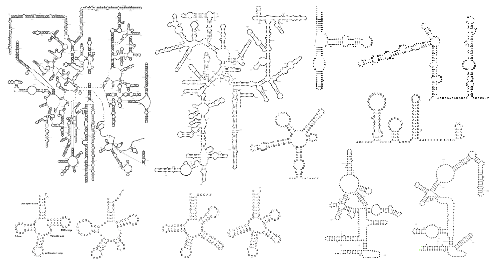

# R2DT

**Version 1.3 (October 2022)**

The R2DT software (RNA 2D Templates) automatically generates [RNA secondary structure](https://en.wikipedia.org/wiki/Nucleic_acid_secondary_structure) diagrams in standard layouts using a template library representing a wide range of RNAs

## Examples

The following example visualisations show LSU, SSU, and 5S rRNA, four tRNAs, two RNAse P, snoRNA, MoCo riboswitch, and U4 snRNA.

## Getting started

R2DT can be used in a number of ways:

* [Web application](https://rnacentral.org/r2dt) hosted by RNAcentral
* [API](https://www.ebi.ac.uk/Tools/common/tools/help/index.html?tool=r2dt) powered by EMBL-EBI Web Services
* As a command line tool with [Docker](https://www.docker.com), [Singularity](https://sylabs.io/docs/#singularity), or in a bare metal installation

## Method overview

The R2DT pipeline includes the following steps:

1. **Generate a library of covariance models** using BPSEQ files from [CRW](http://www.rna.icmb.utexas.edu/DAT/3C/Structure/index.php), RiboVision or another source with [Infernal](http://eddylab.org/infernal/). For best results, remove pseudoknots from the secondary structures using [RemovePseudoknots](https://rna.urmc.rochester.edu/Text/RemovePseudoknots.html) from the RNAStructure package.
1. **Select the best matching covariance model** for each input sequence
using [Ribovore](https://github.com/nawrockie/ribovore) or [tRNAScan-SE 2.0](http://lowelab.ucsc.edu/tRNAscan-SE/).
1. **Fold** input sequence into a secondary structure compatible with the template
using the top scoring covariance model.
1. **Generate secondary structure diagrams** using [Traveler](https://github.com/davidhoksza/traveler) and the secondary structure layouts.

See the [R2DT paper](https://www.nature.com/articles/s41467-021-23555-5) for more details.

## Release process

All R2DT releases are [available](https://github.com/RNAcentral/R2DT/releases) on GitHub. R2DT uses [git flow](https://github.com/RNAcentral/R2DT/wiki) for managing the release process.

## Citation

Please cite the following article if you use R2DT in your research:

