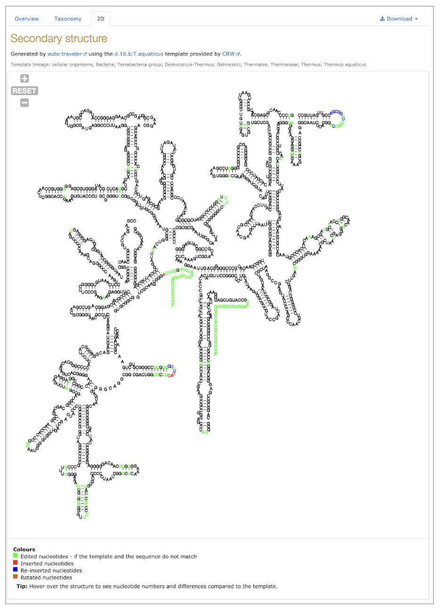

# First R2DT structures are live

*This post originally appeared on the [RNAcentral blog](https://blog.rnacentral.org/2019/06/rnacentral-release-12.html) on June 10th 2019. At that time R2DT was called **auto-traveler**.*

As of RNAcentral release 12, in addition to the secondary structures (2Ds) provided by Expert Databases, such as [GtRNAdb](https://www.rnacentral.org/expert-database/gtrnadb), RNAcentral now also displays 2D visualisations for [>3 million rRNA sequences](https://rnacentral.org/search?q=has_secondary_structure:%22True%22) using the [auto-traveler](https://github.com/RNAcentral/R2DT) software that automatically generates the diagrams in standard layouts (*manuscript in preparation*).

These familiar layouts enable comparison between structures and show the differences relative to the template. For example, in the following _Thermus thermophilus_ [small ribosomal subunit structure](https://rnacentral.org/rna/URS000080E226/274) nucleotides in black are unchanged compared to the [CRW](https://crw2-comparative-rna-web.org/crw1_legacy/) template and the differences are shown in different colours:

At this time only SSU and 5S rRNA are supported (work on visualising other RNA types is underway). We would like to thank [Dr David Hoksza](https://github.com/davidhoksza) for the help with the Traveler software and the [Gutell lab](https://crw2-comparative-rna-web.org/crw1_legacy/) for providing the rRNA templates. For more details, see the [help centre](https://rnacentral.org/help/secondary-structure) or browse the sequences in RNAcentral.
