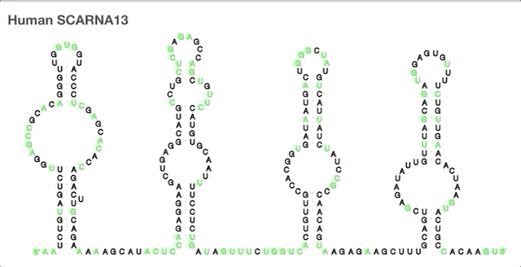
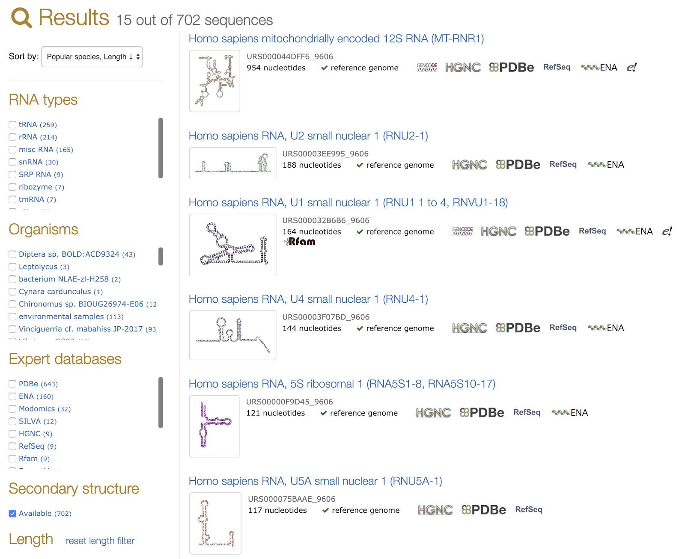
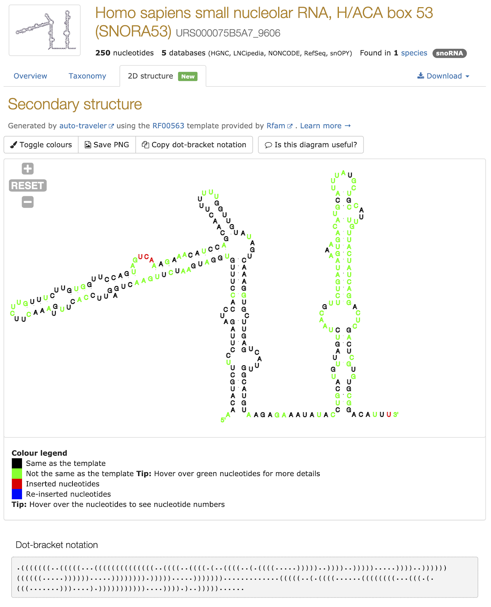

# Rfam families visualised with R2DT

*This post originally appeared on the [RNAcentral blog](https://blog.rnacentral.org/2019/09/rnacentral-release-13.html) on September 9th 2019. At that time R2DT was called **auto-traveler**.*

Starting with release 12, RNAcentral has included secondary structure (2D) diagrams for small subunit and 5S rRNAs. The structures are visualised using family-specific templates so that related RNAs look in a similar way.

Now we expanded the [auto-traveler](https://github.com/RNAcentral/R2DT) pipeline to use Rfam consensus secondary structure diagrams as templates so that RNA sequences from >2,000 Rfam families can be displayed in consistent orientations. One can visually compare 2D structures of sequences from the same family. For example, the following diagram shows the [human](https://rnacentral.org/rna/URS000026BDF0/9606) and [mouse](https://rnacentral.org/rna/URS00006550DA/10090) SCARNA13 drawn in the same orientation using the [RF00231](http://rfam.org/family/RF00231) consensus as a template:

The colours tell whether the sequence is identical to the Rfam consensus (shown in black) or is different (shown in green).

The new 2D diagrams are now shown in text search results:

and sequence report pages where you can explore the diagram by zooming and panning. We invite your feedback about individual 2D structures so please click on the Is this diagram useful? button and let us know what you think.

Work is underway on generating 2D diagrams for large subunit rRNAs and the remaining Rfam families. For details on the new data, see the help centre or browse the new structures in RNAcentral.
