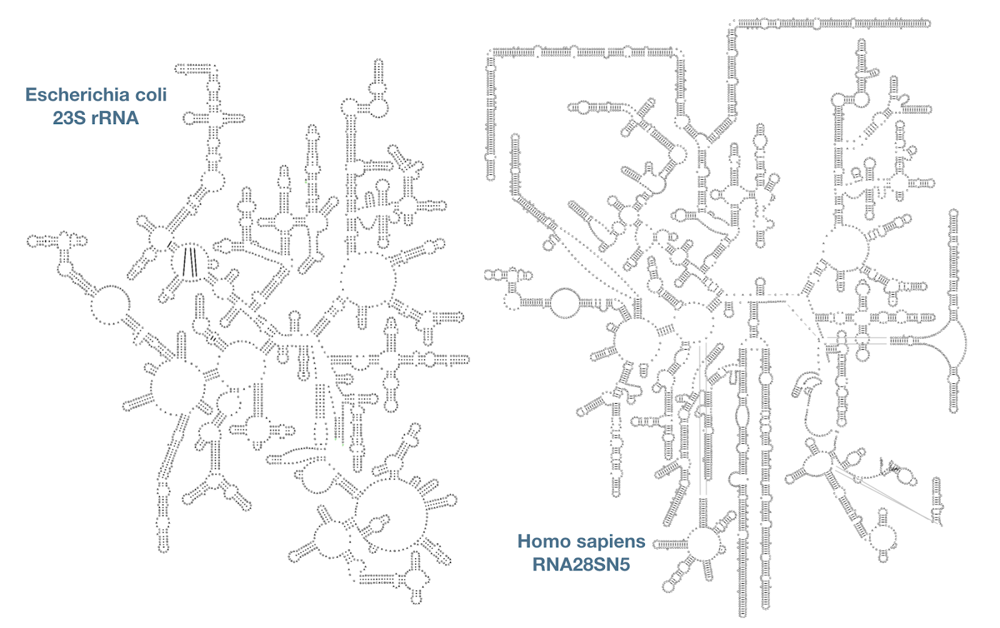

# LSU structures using single-page layouts

*This post originally appeared on the [RNAcentral blog](https://blog.rnacentral.org/2019/12/rnacentral-release-14.html) on December 20th 2019. At that time R2DT was called **auto-traveler**.*

We continue to expand the coverage of the RNA secondary structure space. After generating diagrams for [SSU and 5S rRNA](./2019-06-first-structures-are-live.md) as well as [>2,000 Rfam families](./2019-09-rfam-families-in-r2dt.md), we now provide secondary structure visualisations for the large ribosomal subunits (LSU). For example, here are the human and the Escherichia coli LSUs displayed using [single-page layouts](https://journals.plos.org/plosone/article?id=10.1371/journal.pone.0088222):

This work was done in collaboration with [Anton S. Petrov](https://cool.gatech.edu/people/petrov-anton) and [Loren Dean Williams](https://cool.gatech.edu/people/williams-loren-dean) from the [Center for the Origins of Life](https://cool.gatech.edu/) (COOL) at Georgia Tech, who generated [17 manually curated LSU templates](http://apollo.chemistry.gatech.edu/RibosomeGallery/) based on the experimentally determined 3D structures. These templates cover a wide taxonomic distribution in order to accurately model the expansion segments. The [auto-traveler](https://github.com/RNAcentral/R2DT) software now supports the LSU templates and generated >100,000 LSU diagrams.
For the first time it is possible to visualise some of the largest known structured RNAs using a fully automatic approach. Explore the new structures in RNAcentral.
