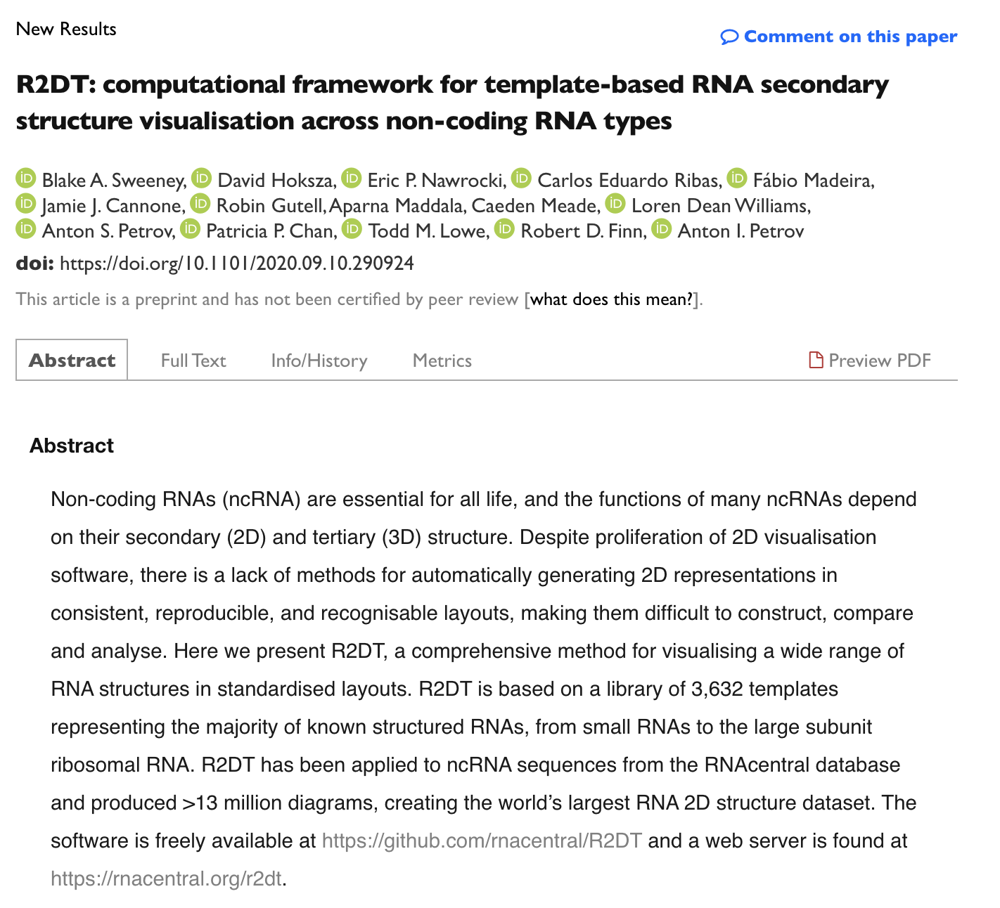

# Biorxiv preprint

*This post originally appeared on the [RNAcentral blog](https://blog.rnacentral.org/2020/09/rnacentral-release-16.html) on September 21st 2020.*

The RNAcentral [secondary structure diagrams](https://rnacentral.org/search?q=has_secondary_structure:%22True%22) are generated in standard, reproducible, and recognisable orientations using [R2DT](https://rnacentral.org/r2dt). Now R2DT has been described in a [new preprint](https://www.biorxiv.org/content/10.1101/2020.09.10.290924v1) where you can find the details of the method and its comprehensive validation. In RNAcentral release 16, R2DT has been used to generate >14 million secondary structure diagrams, creating the world’s largest set of RNA secondary structures.

You can [browse](https://rnacentral.org/search?q=has_secondary_structure:%22True%22) the secondary structures, try the [R2DT web server](http://rnacentral.org/r2dt), or check out the R2DT [source code](https://github.com/rnacentral/r2dt) on GitHub.
