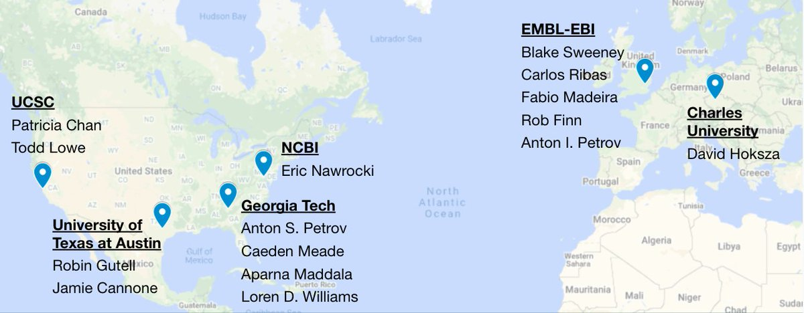

# R2DT paper is out in Nature Communications

*This post originally appeared on the [RNAcentral blog](https://blog.rnacentral.org/2021/06/r2dt-paper-is-out-in-nature.html) on June 9th, 2021.*

We are happy to announce that a paper describing [R2DT](https://rnacentral.org/r2dt), a method for visualising RNA secondary structures in consistent, reproducible, and recognisable layouts, has been published in [Nature Communications](https://www.nature.com/articles/s41467-021-23555-5).

R2DT powers the secondary structure visualisations in [RNAcentral](https://rnacentral.org/) and enables displaying of a wide range of RNA structures in familiar layouts, from small RNAs like tRNAs to some of the largest known structured RNAs, such as the large ribosomal subunit RNA.

You can [find out more about R2DT](https://www.embl.org/news/science/visualising-rna-structures-using-r2dt/) in on the EMBL website, including a story about how R2DT helped with public engagement in primary schools, or visualise your RNA sequence using the [R2DT web server](https://rnacentral.org/r2dt).

R2DT is the result of a community effort across several disciplines, including 6 different groups in 3 countries. We would like to thank everyone who contributed to this project!

The success of the method depends on having a large number of high quality templates for different RNA types provided by the RNA community. We are always looking for more templates, so if you have any diagrams you would like to have included, please reach out to us on [GitHub](https://github.com/r2dt-bio/R2DT), [Twitter](https://twitter.com/rnacentral), or by [email](https://rnacentral.org/contact).
