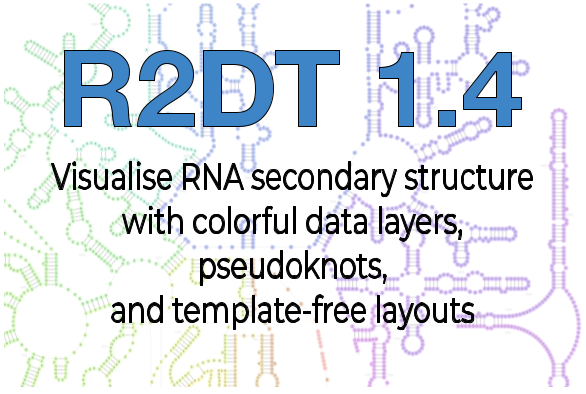
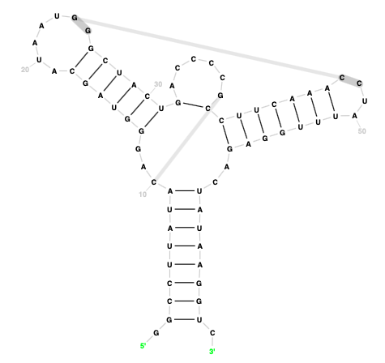

# R2DT Version 1.4

We are excited to announce a new release of [R2DT](../index.md). Version 1.4 enables new kinds of visualisations, adds new templates, and brings important technical improvements. Read on to find out more.

## Visualising alignment accuracy

R2DT can now [visualise additional annotations](../annotations.md) as data layers on top of the secondary structure diagrams. By default, R2DT displays the expected accuracy of the alignment between the query sequence and the template. The accuracy is calculated by the [Infernal software](http://eddylab.org/infernal/) as posterior probabilities.

For example, the following diagram shows the secondary structure of a [SAM riboswitch](http://rfam.org/family/RF00162) RNA sequence from _Bacillus subtilis_ visualised using the RF00162 Rfam template. The coloured circles highlight the hairpin loop region where Infernal is not 100% confident in the alignment:

  <embed id="svg-sam" type="image/svg+xml" style="width: 500px; height: 500px;" src="https://docs.r2dt.bio/en/latest/_images/URS00002D29F6_224308-RF00162.enriched.svg" />

[Find out how](../annotations.md) how to visualise your own data, configure colours, and more.

## Displaying pseudoknots

[Pseudoknot](https://en.wikipedia.org/wiki/Pseudoknot) visualisation has been one of the most requested features since R2DT’s launch. Starting with version 1.4, R2DT uses templates derived from [Rfam](https://rfam.org/) families that have pseudoknots annotated in the consensus secondary structure (`SS_cons` lines of the [Stockholm file format](https://en.wikipedia.org/wiki/Stockholm_format)). Upon alignment of a target sequence to the covariance model using [Infernal](http://eddylab.org/infernal/), the pseudoknot annotation is transferred to the alignment using the `cmalign` program. The following secondary structure of the [Cripavirus IRES](https://rfam.org/family/RF00458) includes three pseudoknots:

  <embed id="svg-cripavirus" type="image/svg+xml" style="width: 600px; height: 300px;" src="https://docs.r2dt.bio/en/latest/_images/cripavirus-ires.svg" />

## Template-free display

Starting with version 1.4, it is possible to visualise a sequence and its secondary structure [without an existing template](../usage.md#template-free-visualisation) using a layout generated by [R2R](https://bmcbioinformatics.biomedcentral.com/articles/10.1186/1471-2105-12-3). This functionality is useful as a starting point when generating new templates or in cases when the R2DT template library does not yet have a template for a certain RNA. [Find more in the docs](../usage.md#template-free-visualisation).

The output files are organised in the standard way and include SVG and [RNA 2D JSON Schema](https://github.com/LDWLab/RNA2D-data-schema/) files, and [can be edited](../editors.md) in RNAcanvas and xRNA-React.

## New templates

- New mito-Vertebrate tRNA and RNAse P templates have been provided by [Patricia Chan](https://github.com/patriciaplchan).
- New 3D-based RNAse P template for _M. jannaschii_ and _T. maritima_ submitted by [Anton S. Petrov](https://scholar.google.com/citations?user=V9KP2IkAAAAJ&hl=en).
- The Rfam templates have been updated using [Rfam release 14.9](https://xfam.wordpress.com/2022/11/15/rfam-release-14-9/).

## Other updates

- The documentation has been migrated to the Read The Docs platform and can be found at [docs.r2dt.bio](http://docs.r2dt.bio).
- Ribovore, Traveler, Vienna RNA, R-scape, and other dependencies have been updated.
- Automated pre-commit software quality checks have been added.
- A new process for testing changes using image similarity instead of file identity has been implemented.
- R2DT now runs natively on Apple silicon.
- The Docker image size has been reduced 5x.

## Teamwork makes the dream work

A big thank you to everyone who helped make this release possible, especially:

- [David Hoksza](https://github.com/davidhoksza) for adding support for data layers and pseudoknots to the [Traveler software](https://github.com/cusbg/traveler),
- [Eric Nawrocki](https://github.com/nawrockie) for help with the [Infernal](http://eddylab.org/infernal/) software suite,
- [Elena Rivas](https://github.com/RivasLab) for help with optimising the [R-scape](http://rivaslab.org/) installation,
- [Patricia Chan](https://github.com/patriciaplchan) and the [Rfam team](https://docs.rfam.org/en/latest/rfam-team.html) for new templates,
- [Ronny Lorenz](https://github.com/RaumZeit) for help with Vienna RNA python bindings on Apple silicon,
- [Anton S. Petrov](https://scholar.google.com/citations?user=V9KP2IkAAAAJ&hl=en), [Blake Sweeney](https://www.ebi.ac.uk/about/people/blake-sweeney), and everyone else from the [R2DT team](https://docs.r2dt.bio/en/latest/team.html).

Last but not least, welcome to a new contributor, [Alexey Nayden](https://github.com/anayden), who bravely re-engineered the Docker image and developed the new testing setup 👏👏👏

## Summary

The new software is now available on [GitHub](http://github.com/rnacentral/r2dt) and [Docker Hub](https://hub.docker.com/r/rnacentral/r2dt). The RNAcentral web app and the API will be updated with the new software in the coming weeks. Stay tuned for future releases and feel free to let us know if you have any feedback by [raising an issue](http://github.com/rnacentral/r2dt/issues/new) on GitHub.

