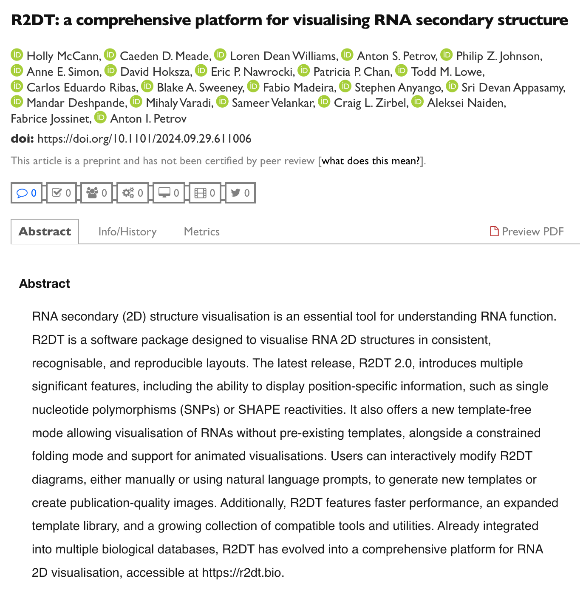

# R2DT Version 2.0 and new preprint

We are excited to announce the release of R2DT version 2.0! This release includes a number of new features and improvements, including:

- Faster performance thanks to a new BLAST-based filtering step for faster template identification
- Using [RNArtist](https://github.com/fjossinet/RNArtist) to generate clearer diagrams with minimized overlaps
- Update Rfam to version 14.10

The release is described in a new [preprint](https://www.biorxiv.org/content/10.1101/2024.09.29.611006v1) published on bioRxiv:

[Try the new version](https://r2dt.bio), view the [release on GitHub](https://github.com/r2dt-bio/R2DT/releases/tag/v2.0), or listen to a [podcast](https://drive.google.com/file/d/10RKmMGpfnDw_czylHLCqKzCVyHLovpot/view) describing the new features (generated using NotebookLM).
