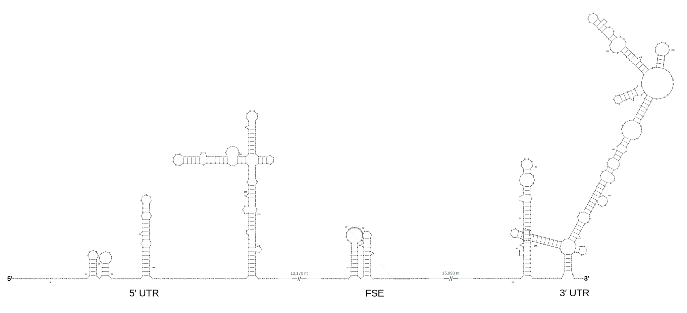
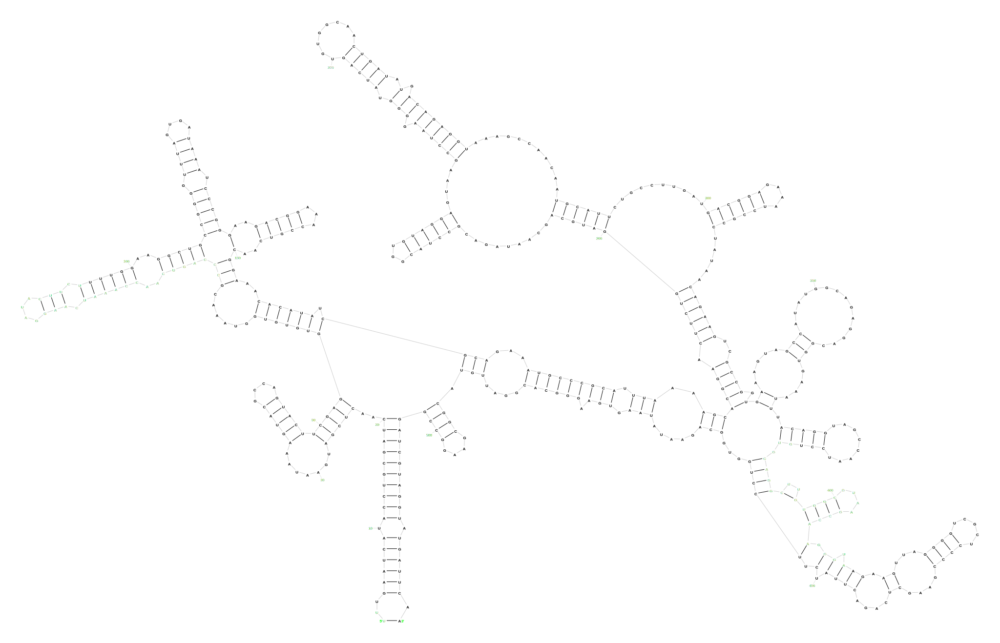

# R2DT Version 2.2

We are excited to announce the release of R2DT version 2.2! This release introduces powerful new capabilities for working with multiple sequence alignments, viral genomes, and 3D structures, as well as a new overlap-free layout engine and improved handling of large insertions.

## Highlights

### New `viral-annotate` command

R2DT can now automatically scan viral genomes to identify and visualise all non-coding RNA elements in a single command:

```bash
r2dt.py viral-annotate genome.fasta output/
```

This command:
- Scans genomes against the Rfam database using covariance models
- Uses Rfam gathering (GA) thresholds for reliable hit detection
- Automatically generates 2D structure diagrams for each RNA family found
- Calculates appropriate database size for accurate E-values

The new workflow enables comprehensive RNA structure annotation for any viral genome, identifying key regulatory elements like 5′/3′ UTRs, IRES elements, frameshift signals, and more.



*Combined view of SARS-CoV-2 RNA structures: 5′ UTR, FSE (frameshift element), and 3′ UTR.*

### New `stitch` command for combined diagrams

The new `stitch` command combines multiple R2DT diagrams into a single panoramic view:

```bash
r2dt.py stitch output/*.svg -o combined.svg --sort --captions "5′ UTR" --captions "FSE"
```

Key features:
- **Automatic sorting** by genomic coordinates extracted from filenames
- **Customisable join glyphs** (break, bead, bar, or none)
- **Gap labels** showing nucleotide distances between structures
- **Connected outline stroke** for visual continuity
- **Monochrome or color** output for publications or presentations
- **Normalised font sizes** for consistent appearance across panels

### New `pdb` command for RCSB structures

Generate 2D diagrams directly from PDB structure IDs or local structure files:

```bash
r2dt.py pdb 1EHZ output/
r2dt.py pdb structure.cif.gz output/   # local files supported
r2dt.py pdb 9FN3 output/ --basepairs rnaview  # use RNAView instead of FR3D
```

R2DT now detects missing (unresolved) nucleotides in PDB structures and shows them as greyed-out positions so the full deposited sequence is always represented. See [Visualising RNA from PDB structures](../pdb.md) for details.



### New `stockholm` command for multiple sequence alignments

The new `stockholm` command processes Stockholm-format multiple sequence alignments with named secondary structure regions. It extracts annotated structural elements, computes RF-style consensus sequences with IUPAC codes, and generates template-free visualisations that are automatically stitched into a combined diagram:

```bash
r2dt.py stockholm examples/hcv-alignment.stk output/hcv/
```

The output includes three stitched variants: full diagram, outline-only, and a compact thumbnail silhouette. Panels can be coloured by structure name, genomic region, or a custom TSV palette. See [Processing Stockholm alignments](../stockholm-alignments.md) for full details.

### RNApuzzler layout engine

R2DT now includes [RNApuzzler](https://doi.org/10.1371/journal.pcbi.1006768) (via ViennaRNA) as a third template-free layout engine alongside R2R and RNArtist. RNApuzzler produces **overlap-free** layouts by construction, making it particularly useful for large or complex RNA structures where R2R and RNArtist produce overlapping diagrams.

```bash
# Use RNApuzzler explicitly
r2dt.py templatefree input.fasta output/ --rnapuzzler

# Run all three engines and pick the best layout automatically
r2dt.py templatefree input.fasta output/ --auto
```

The `--auto` mode runs R2R, RNArtist, and RNApuzzler in parallel and selects the layout with the fewest overlaps. The Stockholm command also uses RNApuzzler by default (with R2R fallback).

### Insertion arcs for large insertions

Large insertions (>100 nt) relative to R2DT templates are replaced with `XXXX` placeholder characters to keep diagrams legible. Previously these appeared as four plain letters. R2DT now replaces them with smooth **curved arcs** that follow the backbone path, with a label showing how many nucleotides were removed. Stray base-pair lines behind the arc are automatically cleaned up.

### Covariation visualisation

When processing [R-scape](https://doi.org/10.1038/nmeth.4066) Stockholm files, R2DT now automatically detects covariation annotations and generates a second SVG with coloured circles indicating positions with statistically significant covariation. See [Covariation visualisation](../covariation.md) for details.

## Other improvements

- **3D structure animation** — generate animated SVG transitions between PDB conformations (see [Animating from PDB files](../pdb.md#animating-rna-secondary-structures))
- **Updated Rfam templates** to release 15.0
- **Updated Ribovore** to the latest version
- **Integrated precomputed library** — Rfam and CRW models are now included in the Docker image for faster setup
- **Improved FASTA handling** — T to U conversion for RNA visualisation
- **Enhanced `rnaview.py`** with support for multiple models and chains in PDB files
- **Security updates** — Bumped Jinja2 to version 3.1.6

## Documentation

- New [Processing Stockholm alignments](https://r2dt.readthedocs.io/en/latest/stockholm-alignments.html) guide
- New [Annotating viral genomes](https://r2dt.readthedocs.io/en/latest/viral-genomes.html) tutorial
- New [Covariation visualisation](https://r2dt.readthedocs.io/en/latest/covariation.html) guide
- New [Visualising RNA from PDB structures](https://r2dt.readthedocs.io/en/latest/pdb.html) guide
- Added [XRNA-React user manual](https://r2dt.readthedocs.io/en/latest/xrna-react-user-guide.html)
- Updated installation guide with simplified Docker workflow

## Getting started

Pull the latest Docker image:

```bash
docker pull rnacentral/r2dt:latest
```

Or visit [r2dt.bio](https://r2dt.bio) to try R2DT online.

## Links

- [Full documentation](https://r2dt.readthedocs.io/)
- [GitHub release](https://github.com/r2dt-bio/R2DT/releases)
- [Report issues](https://github.com/r2dt-bio/R2DT/issues)

## Acknowledgements

Special thanks to [Tomasz Wirecki](https://github.com/fryzjergda) for his contributions to the RNAView integration and animation features.
