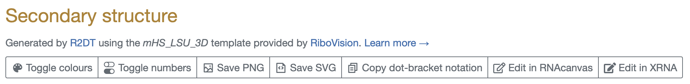
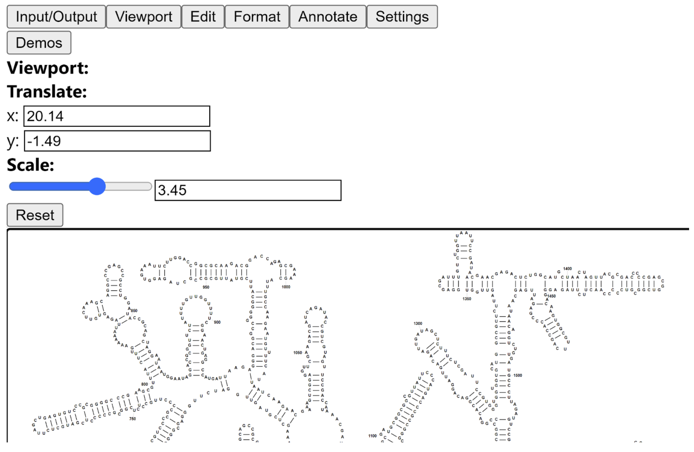

# Editing R2DT diagrams

RNA structures generated by [R2DT](https://rnacentral.org/r2dt) can be edited by clicking the `Edit in RNAcanvas` or `Edit in XRNA` buttons or by downloading the RNA structure in SVG format and opening it in an SVG editor.



## RNAcanvas

```{figure} images/rnacanvas.png
:alt: RNAcanvas screenshot

Screenshot of the RNAcanvas user interface showing human mitochondrially encoded 12S rRNA ([MT-RNR1](https://rnacentral.org/rna/URS000044DFF6/9606)). The layout and most of the secondary structure was generated by R2DT, while the additional font, color, background, and non-canonical interactions were added in RNAcanvas.
```

[RNAcanvas](https://rnacanvas.app) supports the following features:
- Loading RNA structures in [RNA 2D JSON Schema format](https://github.com/LDWLab/RNA2D-data-schema/)
- Adding/removing/editing base pairs (both secondary and tertiary)
- Dragging nucleotides to change their position
- Highlighting of complementary sequences
- Adding/removing/editing nucleotide numbers
- Customizing residues text (e.g., font, size, color)
- Circling/highlighting of residues
- Customizing residues according to structure probing data (e.g., SHAPE)
- Full support for [Leontis-Westhof notation](https://pubmed.ncbi.nlm.nih.gov/11345429/) for base pairs
- Text labels for structural features (e.g., hairpins, linker regions)
- Colored shape labels for residues (e.g., triangles pointing at residues)
- Shading of subsequences of residues
- Motif finding functionality
- Export the edited diagram in SVG and PowerPoint (PPTX) formats
- Granular scaling of exported diagrams (i.e., at the level of individual elements)

<a href="https://rnacanvas.app/?rna_2d_schema_url=https://raw.githubusercontent.com/RNAcentral/R2DT/develop/docs/files/URS000044DFF6.json" target="_blank" class="btn btn-primary btn-lg">Edit an example structure in RNAcanvas</a>

Watch RNAcanvas editing R2DT output in action:

```{eval-rst}
.. raw:: html

    <div style="position: relative; padding-bottom: 56.25%; margin-bottom: 10px; height: 0; overflow: hidden; max-width: 100%; height: auto;">
        <iframe src="https://www.youtube.com/embed/FEoWgaVOWn8" frameborder="0" allowfullscreen style="position: absolute; top: 0; left: 0; width: 100%; height: 100%;"></iframe>
    </div>
```

## XRNA-React



[XRNA-React](https://github.com/LDWLab/XRNA-React) was inspired by the XRNA software developed by [Harry Noller](https://en.wikipedia.org/wiki/Harry_F._Noller). It is an upgraded web-based version of RNA 2D editor and supports the following features:

- Loading RNA structures in SVG and [RNA 2D JSON Schema](https://github.com/LDWLab/RNA2D-data-schema/) formats
- Selection and editing of the structures using one of the following **constraint modes**:
    - single nucleotide
    - single strand
    - single base-pair
    - helix
    - stacked helix
    - RNA sub-domain
    - RNA circle
    - RNA molecule (chain)
    - RNA complex
    - entire scene
- Formatting 2D layouts
- Export the edited diagram in SVG and RNA 2D JSON Schema formats.

<a href="https://ldwlab.github.io/XRNA-React/?source_url=https://raw.githubusercontent.com/RNAcentral/R2DT/develop/docs/files/URS000044DFF6.json" target="_blank" class="btn btn-primary btn-lg">Edit an example structure in xRNA React</a>

### Constraint modes

Within a given mode, all nucleotides in a group are automatically selected, upon left-clicking a mouse over a particular nucleotide within the desired region of the RNA scene. Nucleotide positions can further be transformed (edited) according to certain rules specific to a given mode. For example, the position of a single nucleotide can be adjusted in x and y directions; positions of nucleotides in a selected single-stranded region can be adjusted to an equally spaced  straight line, or an arch of a given radius; positions of a single base pair can be adjusted in x or y directions, as well as their rotational orientation can also be specified. All selected objects are transformed as rigid bodies, respecing the existing base pairing topology.

### Formatting 2D layouts

Formatting regime adjusts the topology (base-pairing) of 2D layouts. This can be done either by simple alterations in base pairing or by combined adjustment of base pairing and positions. By default the simplified base-pairing type would be detected and assigned by the built-in algorithm. Users also have an ability to explicitly specify a base pair type according to Leontis-Westhof notation.

The first option assumes only a creation of new baseparing or deletions of the existing base-paring without adjusting the positions of nucleotides. Modifications are accompanied by adjustment of the constraint mode. Thus, if a base pair was added to a single nucleotide, it becomes assigned as a single base pair, if n base pairs were removed from a helix, those become assigned as two single strands.

The second option assumes automatic adjustments of nucleotide positions, whose topologies were altered. Thus, two remote single-stranded regions would be rearranged into a regular helical block, with default values of helical parameters (distance between adjacent nucleotides, distances between various types of base pairs). Similar adjustments are implemented for other constraint modes. The default settings can further be adjusted to the desired values, if needed.

## SVG editors

It is also possible to edit the secondary structures generated by R2DT in any application that supports editing SVG files, for example:

- [GIMP](https://www.gimp.org)
- [Inkscape](https://inkscape.org)
- [Adobe Illustrator](https://www.adobe.com/uk/products/illustrator.html)

## RNA 2D JSON Schema

Both RNAcanvas and XRNA-React work by loading RNA structures in [RNA 2D JSON Schema](https://github.com/LDWLab/RNA2D-data-schema/) format that captures RNA sequence, secondary structure, the `(x, y)` coordinates of each nucleotides, as well as additional information such as nucleotide labels and nucleotide colors.

```{eval-rst}
Download an :download:`example RNA 2D JSON Schema </files/URS000044DFF6.json>` file.
```

R2DT generates RNA 2D JSON Schema files that can be loaded into RNAcanvas and XRNA-React. Alternatively, you can create your own RNA 2D JSON Schema files and load them into RNAcanvas and XRNA-React using the following URLs:

    - https://rnacanvas.app/?rna_2d_schema_url=<http://url to RNA 2D JSON Schema file>
    - https://ldwlab.github.io/XRNA-React/?source_url=<http://url to RNA 2D JSON Schema file>
