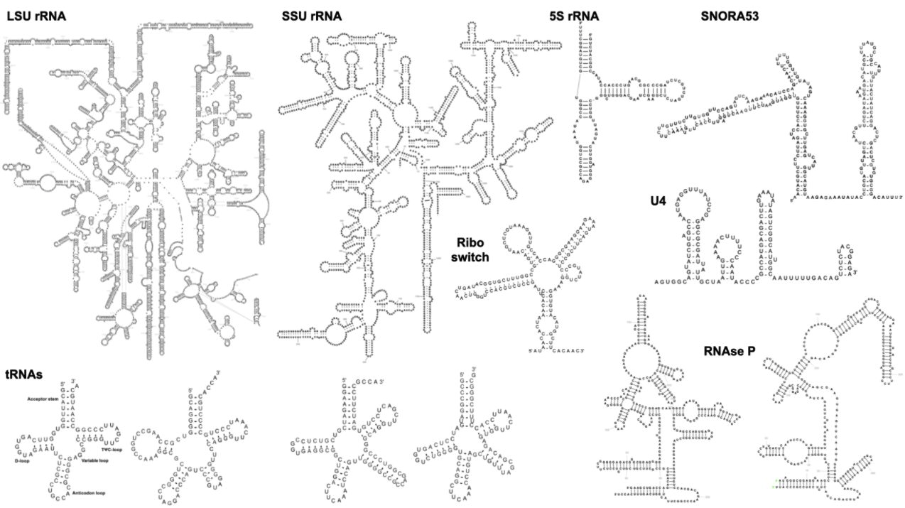

# R2DT documentation

[](https://r2dt.readthedocs.io/en/latest/?badge=latest)
[](https://github.com/rnacentral/r2dt/releases/)
[](https://www.nature.com/articles/s41467-021-23555-5)
[](https://github.com/rnacentral/r2dt/stargazers/)

## What is R2DT?

The [R2DT software](https://github.com/RNAcentral/R2DT) automatically generates [RNA secondary structure](https://en.wikipedia.org/wiki/Nucleic_acid_secondary_structure) diagrams in consistent, reproducible and recongnisable layouts using a library of templates representing a wide range of RNAs.

## Try it now

<r2dt-web
        examples='[
          {"description": "RNA5S1-8", "sequence": "GUCUACGGCCAUACCACCCUGAACGCGCCCGAUCUCGUCUGAUCUCGGAAGCUAAGCAGGGUCGGGCCUGGUUAGUACUUGGAUGGGAGACCGCCUGGGAAUACCGGGUGCUGUAGGCUUU"},
          {"description": "MT-RNR1", "sequence": "AAUAGGUUUGGUCCUAGCCUUUCUAUUAGCUCUUAGUAAGAUUACACAUGCAAGCAUCCCCGUUCCAGUGAGUUCACCCUCUAAAUCACCACGAUCAAAAGGAACAAGCAUCAAGCACGCAGCAAUGCAGCUCAAAACGCUUAGCCUAGCCACACCCCCACGGGAAACAGCAGUGAUUAACCUUUAGCAAUAAACGAAAGUUUAACUAAGCUAUACUAACCCCAGGGUUGGUCAAUUUCGUGCCAGCCACCGCGGUCACACGAUUAACCCAAGUCAAUAGAAGCCGGCGUAAAGAGUGUUUUAGAUCACCCCCUCCCCAAUAAAGCUAAAACUCACCUGAGUUGUAAAAAACUCCAGUUGACACAAAAUAGACUACGAAAGUGGCUUUAACAUAUCUGAACACACAAUAGCUAAGACCCAAACUGGGAUUAGAUACCCCACUAUGCUUAGCCCUAAACCUCAACAGUUAAAUCAACAAAACUGCUCGCCAGAACACUACGAGCCACAGCUUAAAACUCAAAGGACCUGGCGGUGCUUCAUAUCCCUCUAGAGGAGCCUGUUCUGUAAUCGAUAAACCCCGAUCAACCUCACCACCUCUUGCUCAGCCUAUAUACCGCCAUCUUCAGCAAACCCUGAUGAAGGCUACAAAGUAAGCGCAAGUACCCACGUAAAGACGUUAGGUCAAGGUGUAGCCCAUGAGGUGGCAAGAAAUGGGCUACAUUUUCUACCCCAGAAAACUACGAUAGCCCUUAUGAAACUUAAGGGUCGAAGGUGGAUUUAGCAGUAAACUAAGAGUAGAGUGCUUAGUUGAACAGGGCCCUGAAGCGCGUACACACCGCCCGUCACCCUCCUCAAGUAUACUUCAAAGGACAUUUAACUAAAACCCCUACGCAUUUAUAUAGAGGAGACAAGUCGUAACAUGGUAAGUGUACUGGAAAGUGCACUUGGACGAAC"},
          {"description": "S box leader", "sequence": "CTCTTATCGAGAGTTGGGCGAGGGATTTGGCCTTTTGACCCCAAAAGCAACCGACCGTAATTCCATTGTGAAATGGGGCGCATTTTTTTCGCGCCGAGACGCTGGTCTCTTAAGGCACGGTGCTAATTCCATTCAGATCTGATCTGAGAGATAAGAG"},
          {"description": "RNVU1-1", "sequence": "AUACUUACCUGGCAGGGGAGAUACGAUGAUCACGAAGGUGGUUUUCCCAGGGAGAGGCUUAUCCAUUGCACUCCGGAUGUGCUGACCCCUGCCGUUUCCCCAAAUGUGGGAAACUCGACUGCAUAAUUUGUGGUAGUGGGGGACUGCGUUCGCGCUGUCCUCUG"},
          {"description": "PDB 3J7Y chain A", "sequence": "GCTAAACCTAGCCCCAAACCCACTCCACCTTACTACCAGACAACCTTAGCCAAACCATTTACCCAAATAAAGTATAGGCGATAGAAATTGAAACCTGGCGCAATAGATATAGTACCGCAAGGGAAAGATGAAAAATTATAACCAAGCATAATATAGCAAGGACTAACCCCTATACCTTCTGCATAATGAATTAACTAGAAATAACTTTGCAAGGAGAGCCAAAGCTAAGACCCCCGAAACCAGACGAGCTACCTAAGAACAGCTAAAAGAGCACACCCGTCTATGTAGCAAAATAGTGGGAAGATTTATAGGTAGAGGCGACAAACCTACCGAGCCTGGTGATAGCTGGTTGTCCAAGATAGAATCTTAGTTCAACTTTAAATTTGCCCACAGAACCCTCTAAATCCCCTTGTAAATTTAACTGTTAGTCCAAAGAGGAACAGCTCTTTGGACACTAGGAAAAAACCTTGTAGAGAGAGTAAAAAATTTAACACCCATAGTAGGCCTAAAAGCAGCCACCAATTAAGAAAGCGTTCAAGCTCAACACCCACTACCTAAAAAATCCCAAACATATAACTGAACTCCTCACACCCAATTGGACCAATCTATCACCCTATAGAAGAACTAATGTTAGTATAAGTAACATGAAAACATTCTCCTCCGCATAAGCCTGCGTCAGATTAAAACACTGAACTGACAATTAACAGCCCAATATCTACAATCAACCAACAAGTCATTATTACCCTCACTGTCAACCCAACACAGGCATGCTCATAAGGAAAGGTTAAAAAAAGTAAAAGGAACTCGGCAAATCTTACCCCGCCTGTTTACCAAAAACATCACCTCTAGCATCACCAGTATTAGAGGCACCGCCTGCCCAGTGACACATGTTTAACGGCCGCGGTACCCTAACCGTGCAAAGGTAGCATAATCACTTGTTCCTTAAATAGGGACCTGTATGAATGGCTCCACGAGGGTTCAGCTGTCTCTTACTTTTAACCAGTGAAATTGACCTGCCCGTGAAGAGGCGGGCATAACACAGCAAGACGAGAAGACCCTATGGAGCTTTAATTTATTAATGCAAACAGTACCTAACAAACCCACAGGTCCTAAACTACCAAACCTGCATTAAAAATTTCGGTTGGGGCGACCTCGGAGCAGAACCCAACCTCCGAGCAGTACATGCTAAGACTTCACCAGTCAAAGCGAACTACTATACTCAATTGATCCAATAACTTGACCAACGGAACAAGTTACCCTAGGGATAACAGCGCAATCCTATTCTAGAGTCCATATCAACAATAGGGTTTACGACCTCGATGTTGGATCAGGACATCCCGATGGTGCAGCCGCTATTAAAGGTTCGTTTGTTCAACGATTAAAGTCCTACGTGATCTGAGTTCAGACCGGAGTAATCCAGGTCGGTTTCTATCTACTTTCAAATTCCTCCCTGTACGAAAGGACAAGAGAAATAAGGCCTACTTCACAAAGCGCCTTCCCCCGTAAATGATATCATCTCAACTTAGTATTATACCCACACCCACCCAAGAACAGGGTTT"},
          {"description": "TRT-TGT2-1", "sequence": "GGCTCCATAGCTCAGTGGTTAGAGCACTGGTCTTGTAAACCAGGGGTCGCGAGTTCGATCCTCGCTGGGGCCT"},
          {"description": "Rn18s", "sequence": "ACCUGGUUGAUCCUGCCAGGUAGCAUAUGCUUGUCUCAAAGAUUAAGCCAUGCAUGUCUAAGUACGCACGGCCGGUACAGUGAAACUGCGAAUGGCUCAUUAAAUCAGUUAUGGUUCCUUUGGUCGCUCGCUCCUCUCCUACUUGGAUAACUGUGGUAAUUCUAGAGCUAAUACAUGCCGACGGGCGCUGACCCCCCUUCCCGGGGGGGGAUGCGUGCAUUUAUCAGAUCAAAACCAACCCGGUGAGCUCCCUCCCGGCUCCGGCCGGGGGUCGGGCGCCGGCGGCUUGGUGACUCUAGAUAACCUCGGGCCGAUCGCACGCCCCCCGUGGCGGCGACGACCCAUUCGAACGUCUGCCCUAUCAACUUUCGAUGGUAGUCGCCGUGCCUACCAUGGUGACCACGGGUGACGGGGAAUCAGGGUUCGAUUCCGGAGAGGGAGCCUGAGAAACGGCUACCACAUCCAAGGAAGGCAGCAGGCGCGCAAAUUACCCACUCCCGACCCGGGGAGGUAGUGACGAAAAAUAACAAUACAGGACUCUUUCGAGGCCCUGUAAUUGGAAUGAGUCCACUUUAAAUCCUUUAACGAGGAUCCAUUGGAGGGCAAGUCUGGUGCCAGCAGCCGCGGUAAUUCCAGCUCCAAUAGCGUAUAUUAAAGUUGCUGCAGUUAAAAAGCUCGUAGUUGGAUCUUGGGAGCGGGCGGGCGGUCCGCCGCGAGGCGAGUCACCGCCCGUCCCCGCCCCUUGCCUCUCGGCGCCCCCUCGAUGCUCUUAGCUGAGUGUCCCGCGGGGCCCGAAGCGUUUACUUUGAAAAAAUUAGAGUGUUCAAAGCAGGCCCGAGCCGCCUGGAUACCGCAGCUAGGAAUAAUGGAAUAGGACCGCGGUUCUAUUUUGUUGGUUUUCGGAACUGAGGCCAUGAUUAAGAGGGACGGCCGGGGGCAUUCGUAUUGCGCCGCUAGAGGUGAAAUUCUUGGACCGGCGCAAGACGGACCAGAGCGAAAGCAUUUGCCAAGAAUGUUUUCAUUAAUCAAGAACGAAAGUCGGAGGUUCGAAGACGAUCAGAUACCGUCGUAGUUCCGACCAUAAACGAUGCCGACUGGCGAUGCGGCGGCGUUAUUCCCAUGACCCGCCGGGCAGCUUCCGGGAAACCAAAGUCUUUGGGUUCCGGGGGGAGUAUGGUUGCAAAGCUGAAACUUAAAGGAAUUGACGGAAGGGCACCACCAGGAGUGGGCCUGCGGCUUAAUUUGACUCAACACGGGAAACCUCACCCGGCCCGGACACGGACAGGAUUGACAGAUUGAUAGCUCUUUCUCGAUUCCGUGGGUGGUGGUGCAUGGCCGUUCUUAGUUGGUGGAGCGAUUUGUCUGGUUAAUUCCGAUAACGAACGAGACUCUGGCAUGCUAACUAGUUACGCGACCCCCGAGCGGUCGGCGUCCCCCAACUUCUUAGAGGGACAAGUGGCGUUCAGCCACCCGAGAUUGAGCAAUAACAGGUCUGUGAUGCCCUUAGAUGUCCGGGGCUGCACGCGCGCUACACUGACUGGCUCAGCGUGUGCCUACCCUGCGCCGGCAGGCGCGGGUAACCCGUUGAACCCCAUUCGUGAUGGGGAUCGGGGAUUGCAAUUAUUCCCCAUGAACGAGGAAUUCCCAGUAAGUGCGGGUCAUAAGCUUGCGUUGAUUAAGUCCCUGCCCUUUGUACACACCGCCCGUCGCUACUACCGAUUGGAUGGUUUAGUGAGGCCCUCGGAUCGGCCCCGCCGGGGUCGGCCCACGGCCCUGGCGGAGCGCUGAGAAGACGGUCGAACUUGACUAUCUAGAGGAAGUAAAAGUCGUAACAAGGUUUCCGUAGGUGAACCUGCGGAAGGAUCAUUAA"}
        ]'
    />
  <script type="text/javascript" src="https://rnacentral.github.io/r2dt-web/dist/r2dt-web.js"></script>

## How does it work?

Find out more [about R2DT](./about.md), read the [R2DT paper](https://www.nature.com/articles/s41467-021-23555-5), or check out the slides from a recent talk:

<iframe src="https://docs.google.com/presentation/d/e/2PACX-1vRrBpjxq-QiArYPuzQiKZBJVFlHR3vEYGkZUV-W1XcrG6hX1eMAoahJmLU9Vf1VlGSVPfaLYqPqp1Ke/embed?start=false&loop=false&delayms=3000" frameborder="0" width="640" height="389" allowfullscreen="true" mozallowfullscreen="true" webkitallowfullscreen="true"></iframe>
<br>

## Examples

The following example visualisations show LSU, SSU, and 5S rRNA, four tRNAs, two RNAse P, snoRNA, MoCo riboswitch, and U4 snRNA:



## Getting started

R2DT can be used in a number of ways:

* [Web application](https://rnacentral.org/r2dt) hosted by RNAcentral
* [API](https://www.ebi.ac.uk/Tools/common/tools/help/index.html?tool=r2dt) powered by EMBL-EBI Web Services (see [](api.md))
* As a command line tool with [Docker](https://www.docker.com), [Podman](https://podman.io), [Singularity](https://sylabs.io/docs/), or as bare metal [installation](./installation.md)

## Who uses R2DT?

* RNAcentral uses R2DT to visualise [>20 million RNA secondary structures](https://rnacentral.org/search?q=has_secondary_structure:%22True%22)
* PDBe uses R2DT to enable interactive navigation between sequence, 2D and 3D structure (for example, [1S72](https://www.ebi.ac.uk/pdbe/entry/pdb/1s72/RNA/1))
* [Rfam](https://rfam.org/search#tabview=tab1) and [GtRNAdb](http://gtrnadb.ucsc.edu/rnacentral_search.html) display R2DT diagrams in sequence similarity search
* [FlyBase](http://flybase.org/reports/FBgn0053537#gene_model_products) and [SGD](https://www.yeastgenome.org/locus/S000006550/sequence) show R2DT diagrams for RNA genes
* [NAKB](https://www.nakb.org/) uses R2DT to visualise secondary structure of RNAs from PDB (for example, [1S72](https://www.nakb.org/r2dt.html?1S72:2)).

Browse [papers citing R2DT](https://scholar.google.com/scholar?hl=en&as_sdt=2005&sciodt=0,5&cites=12435886377905515481&scipsc=&q=&scisbd=1) &rarr;

## Citation

If you use R2DT in your work, please consider citing the following paper:

> **R2DT is a framework for predicting and visualising RNA secondary structure using templates**
> [Nature Communications](https://www.nature.com/articles/s41467-021-23555-5)

## License

R2DT is available under the [Apache 2.0 license](https://github.com/RNAcentral/R2DT/blob/master/LICENSE).

## Get in touch

If you have any questions or feedback, feel free to [submit a GitHub issue](https://github.com/RNAcentral/r2dt/issues) or contact the [RNAcentral help desk](https://rnacentral.org/contact).

```{eval-rst}
.. toctree::
   :maxdepth: 2
   :caption: Table of Contents

   self
   about
   installation
   usage
   annotations
   api
   widget
   templates
   docs
   testing
   releases
   team
   blog
```

## GitHub

Contribute to the [R2DT project on GitHub](https://github.com/rnacentral/r2dt) &rarr;
