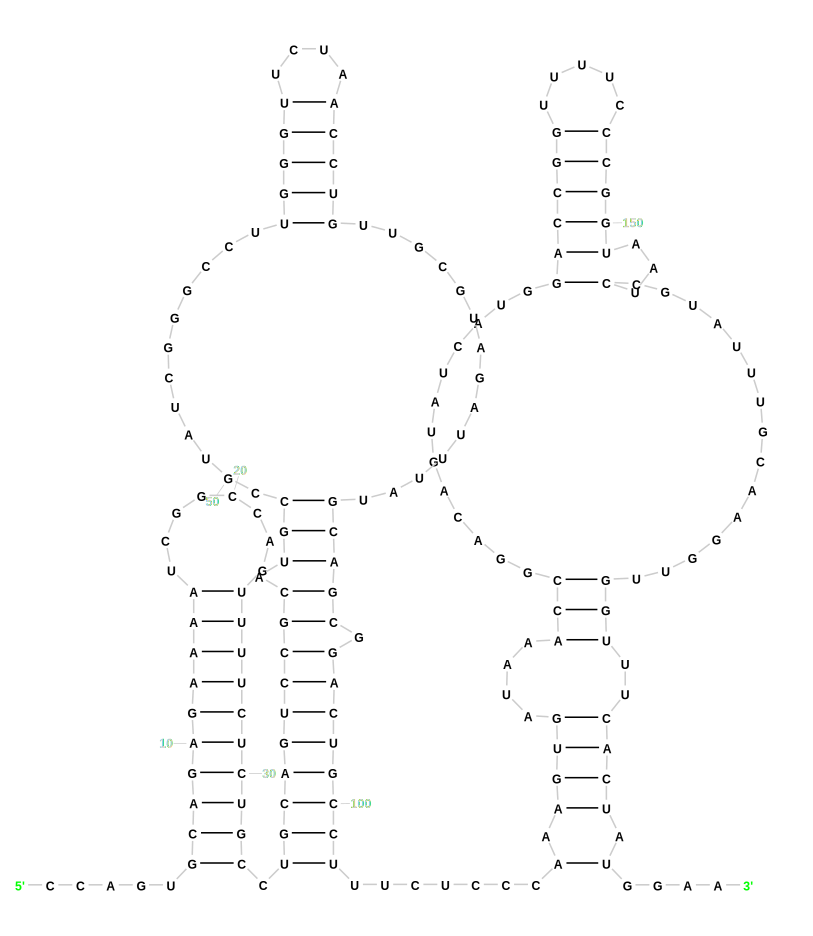
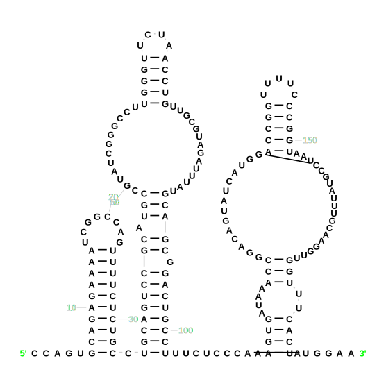

# Command line reference

Specify the input file in [FASTA format](https://en.wikipedia.org/wiki/FASTA_format) containing one or more RNA sequences as well as the path where the output files will be created (the folder will be created if it does not exist).

```bash
r2dt.py draw <input.fasta> <output_folder>
```

For example:

```bash
r2dt.py draw examples/examples.fasta temp/examples
```

R2DT will automatically select the best matching template and visualise the secondary structures.

## Output files

`r2dt.py draw` produces a folder called `results` with the following subfolders:

- `svg`: RNA secondary structure diagrams in SVG format
- `fasta`: input sequences and their secondary structure in dot-bracket notation
- `tsv`: a file `metadata.tsv` listing sequence ids, matching templates, and template sources
- `thumbnail`: secondary structure diagrams displayed as outlines in SVG format
- `json`: RNA secondary structure and its layout described using [RNA 2D JSON Schema](https://github.com/LDWLab/RNA2D-data-schema/)

## Manually selecting template type

If the RNA type of the input sequences is known in advance, it is possible to bypass the classification steps and achieve faster performance.

* CRW templates (5S and SSU rRNA)
    ```bash
    r2dt.py crw draw examples/crw-examples.fasta temp/crw-examples
    ```

* RiboVision LSU and SSU rRNA templates
    ```bash
    r2dt.py ribovision draw_lsu examples/lsu-examples.fasta temp/lsu-examples
    r2dt.py ribovision draw_ssu examples/ribovision-ssu-examples.fasta temp/ssu-examples
    ```

* Rfam families
    ```bash
    r2dt.py rfam draw RF00162 examples/RF00162.example.fasta temp/rfam-example
    ```

    By default, R2DT uses the template with minimum number of overlaps (R-scape or RNArtist). However, it is possible to specify the template type manually.

    Specify `--rnartist` to use the RNArtist template:

    ```bash
    r2dt.py rfam draw RF00162 examples/RF00162.example.fasta temp/rfam-example --rnartist
    ```

    Specify `--rscape` to use the R-scape template:

    ```bash
    r2dt.py rfam draw RF00162 examples/RF00162.example.fasta temp/rfam-example --rnartist
    ```

    These options could be useful to avoid overlaps in the diagrams, for example:

    ```{figure} images/rnartist-example.png
    :alt: R2R vs RNArtist

    A comparison of the cobalamin riboswitch ([RF00174](https://rfam.org/family/RF00174)) visualised using R2R (left) and RNArtist (right). The RNArtist template is more legible and avoids overlaps.
    ```

* RNAse P
    ```bash
    r2dt.py rnasep draw examples/rnasep.fasta temp/rnasep-example
    ```

* tRNAs (using GtRNAdb templates)
    ```bash
    # for tRNAs, provide domain and isotype (if known), or use tRNAScan-SE to classify
    r2dt.py gtrnadb draw examples/gtrnadb.E_Thr.fasta temp/gtrnadb
    r2dt.py gtrnadb draw examples/gtrnadb.E_Thr.fasta temp/gtrnadb --domain E --isotype Thr
    ```

## Manually selecting specific template

It is possible to select a specific template and skip the classification step altogether.

1. Get a list of all available templates and copy the template id:
    ```bash
    r2dt.py list-models
    ```

In addition, all models are listed in the file [models.json](https://github.com/r2dt-bio/R2DT/blob/main/data/models.json).

1. Specify the template (for example, `RNAseP_a_P_furiosus_JB`):
    ```bash
    r2dt.py draw --force_template <template_id> <input_fasta> <output_folder>
    ```

    For example:

    ```bash
    r2dt.py draw --force_template RNAseP_a_P_furiosus_JB examples/force/URS0001BC2932_272844.fasta temp/example
    ```

## Constraint-based folding for insertions

If a structure contains insertions relative to the R2DT template files, they are shown as large unstructured loops. Insertions larger than 100 nucleotides are replaced with a placeholder element (`XXXX` characters) to keep the rest of the diagram legible.

The `--constraint` flag allows de-novo prediction of the insertion structure using the RNAfold algorithm. There are currently three constraint folding modes available. R2DT will automatically predict which folding mode is best for a given molecule, but the mode can also be manually overridden using the --fold_type parameter. There are three options for fold_type.

* Let R2DT pick a fold_type
    ```bash
    r2dt.py draw --constraint <input_fasta> <output_folder>
    ```
* Fold insertions (along with adjacent unpaired nucleotides) one at a time. Recommended for large RNAs.
    ```bash
    r2dt.py draw --constraint --fold_type insertions_only <input_fasta> <output_folder>
    ```
* Run entire molecule through RNAfold at once. Base pairs predicted from the template are used as constraints for prediction.
    ```bash
    r2dt.py draw --constraint --fold_type full_molecule <input_fasta> <output_folder>
    ```
* Run entire molecule through RNAfold at once. Both conserved single-stranded regions and base pairs predicted from the template are used as constraints for prediction.
    ```bash
    r2dt.py draw --constraint --fold_type all_constraints_enforced <input_fasta> <output_folder>
    ```
* Prevent certain nucleotides from base pairing. This will only work for base pairs that are de-novo predicted.
The exclusion file should contain a string the same length as the input sequence composed of '.'s and 'x's. Positions with '.'s are allowed to base pair,
positions with 'x's are not.
Example string: `xxxx..............xx..............x............xx`
    ```bash
    r2dt.py draw --constraint --exclusion <exclusion_file> <input_fasta> <output_folder>
    ```

## Template-free visualisation

It is possible to visualise a sequence and its secondary structure using layouts generated by [R2R](https://bmcbioinformatics.biomedcentral.com/articles/10.1186/1471-2105-12-3) or [RNArtist](https://github.com/fjossinet/RNArtist). This functionality is useful as a starting point when [generating new templates](./templates.md) or in cases when the R2DT template library does not yet have a template for a certain RNA.

Example input found in `examples/template-free.fasta` (pseudoknots can be specified in the Aa, Bb notation):

```
>3SKZ_B
GGCCUUAUACAGGGUAGCAUAAUGGGCUACUGACCCCGCCUUCAAACCUAUUUGGAGACUAUAAGGUC
.((((((((A..((((((.....BB))))))(.....a)(((((((bb..)))))))..)))))))).
```

R2DT automatically detects if the secondary structure is present in the input FASTA file and will use it to generate a diagram:

```bash
r2dt.py draw examples/template-free.fasta temp/template-free-example
```

Alternatively, one can explicit specify the `templatefree` mode:

```bash
r2dt.py templatefree examples/template-free.fasta temp/template-free-example
```

Output diagram:


The output files are organised in the standard way and include SVG and RNA 2D JSON Schema files. The JSON file can be uploaded to [RNAcanvas](https://rnacanvas.app/) for further manual editing, if necessary.

### RNArtist and R2R layouts

Sometimes the output diagrams may contain overlaps:

{w=500px}

Trying a different layout engine could help minimise the overlaps. Currently, it is possible to choose between the R2R (default) and RNArtist layout engines.

Use the `--rnartist` flag to run the RNArtist template:

```bash
r2dt.py templatefree examples/bridge-rna.fasta temp/bridge-rna-rnartist --rnartist
```

Output diagram:



## Skipping ribovore filters

In some cases R2DT may not generate a diagram for a sequence because [ribovore](https://github.com/ncbi/ribovore) detects one or more [unexpected features](https://github.com/ncbi/ribovore/blob/main/documentation/ribotyper.md#unexpectedfeatures), such as having hits on both strands or having too many hits in the same sequence. You can use `--skip_ribovore_filters` to ignore these warnings and attempt to generate a secondary structure diagram anyway.

For example, the following command will produce no results because the sequence is close to a palindrome:

```bash
r2dt.py draw examples/ribovore-qc-example.fasta temp/examples
```

However, the following command generates a [valid diagram](https://github.com/r2dt-bio/R2DT/blob/main/tests/examples/skip-ribovore-filters/URS0000001EB3-RF00661.colored.svg):

```bash
r2dt.py draw --skip_ribovore_filters examples/ribovore-filters.fasta temp/examples
```

Please note that this option should be used with caution as sequences with unexpected features often result in poor diagrams.

## Other useful commands

* Print R2DT version
    ```bash
    r2dt.py version
    ```

* Classify example sequences using Ribotyper
    ```bash
    perl /rna/ribovore/ribotyper.pl -i data/cms/crw/modelinfo.txt -f examples/pdb.fasta temp/ribotyper-test
    ```

* Generate covariance models and modelinfo files
    ```bash
    python3 utils/generate_cm_library.py
    r2dt.py generatemodelinfo <path to covariance models>
    ```

* Precompute template library locally (may take several hours):
    ```bash
    r2dt.py setup
    ```

* Run R2DT with Singularity
    ```bash
    singularity exec --bind <path_to_cms>:/rna/r2dt/data/cms r2dt r2dt.py draw sequence.fasta output
    ```

* Convert a SVG diagram to a JSON file containing the paths per nucleotide and an ordinal numbering. Note that this *assumes* that the input pdb id is formatted like: `<PDB>_<Entity>_<chain>`, ie `1S72_1_0`.
    ```bash
    svg2json.py <pdb-id> diagram.svg <pdb-id>.json
    ```

## Animating RNA secondary structures

R2DT can be used to generate animations of RNA secondary structures. The `animate.py` script takes two R2DT SVG files and generates an animated SVG file that transitions between the two structures.

```bash
python3 utils/animate.py \
    examples/animate/PZ39_solution.svg \
    examples/animate/PZ39_Dfold_3.svg \
    animated.svg
```

:::{note}
Note that the two input SVG files must have the same number of nucleotides.
:::

### Animating RNA secondary structures from PDB files

R2DT can be used to generate secondary structure diagrams directly from PDB files. Additionally R2DT can generate animated SVG file of the transition between two structures between two 3D structures from PDB files.

Genaretion of a diagram from PDB file: 

```bash
python3 utils/rnaview.py \
    examples/PZ1_Bujnicki_1.pdb
```
`PZ1_Bujnicki_1.colored.svg` will be genreated.

:::{note}
Note - in cases that there are multiple interactions detected for one nucleotide, all of them will be omitted in the diagram.
:::

Animated transition between two structures from PDB:

```bash
python3 utils/animate3d.py \
    examples/PZ1_solution_0.pdb \
    examples/PZ1_Bujnicki_1.pdb \
    examples/PZ1_solution_0_to_PZ1_Bujnicki_1.animated.svg
```

Performing animation on a reference PDB file, and a set of PDBs. User needs to specify the reference PDB file, and a directory with query PDB files:

```bash
python3 utils/animate3d.py -b \
    examples/PZ1_solution_0.pdb \
    examples/animate_bulk
```

:::{note}
Note - structures in the PDB files should be of the same length [nt].
:::
