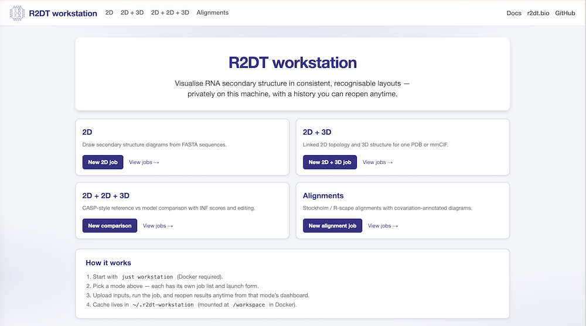
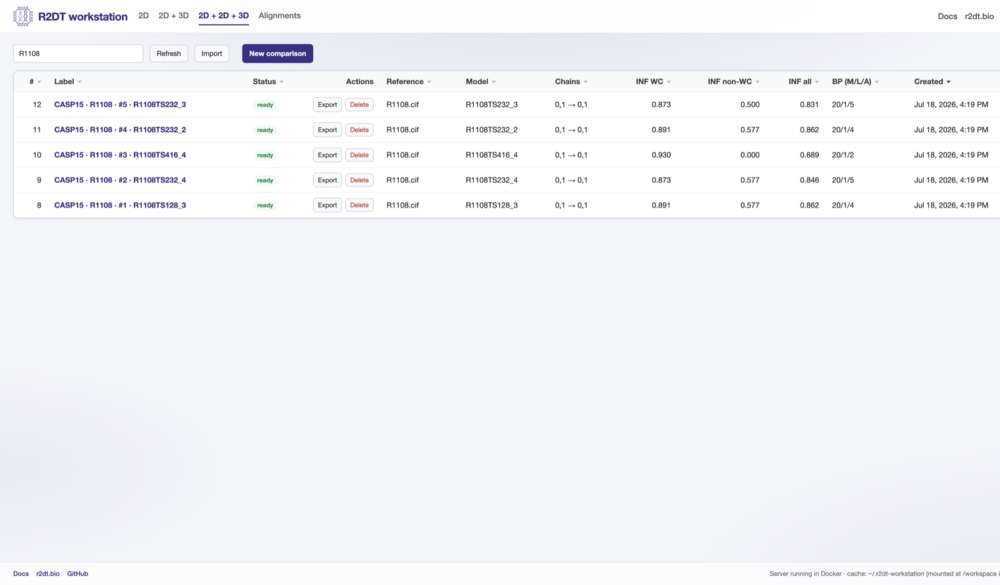
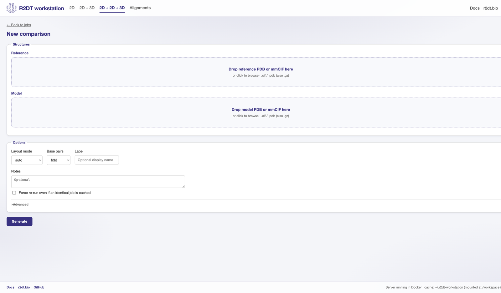
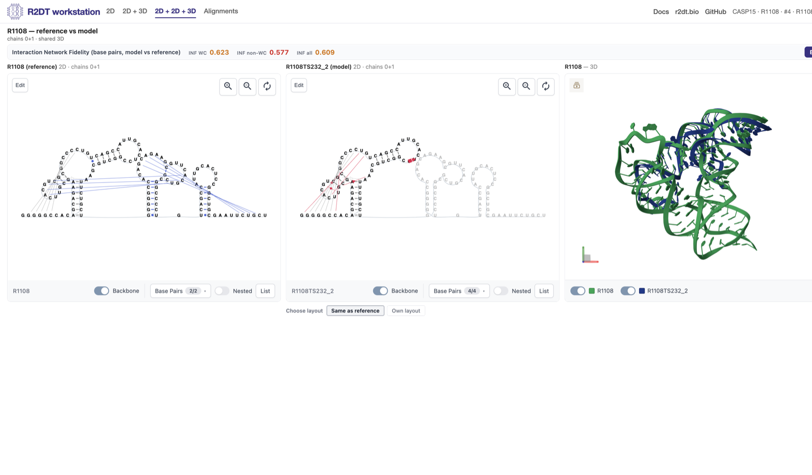
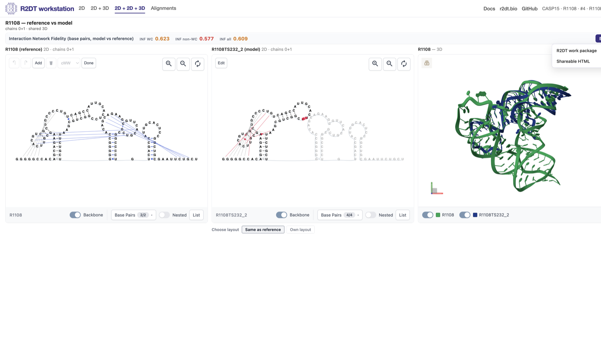

# Local workstation

The R2DT **workstation** is a local browser-based interface that runs on **your own computer** and executes R2DT commands using Docker. Use it to draw RNA diagrams, compare a reference 3D structure with a model, edit base pairs, and export results you can share.

All results stay local until you choose to export. The [command-line interface](./usage.md) remains available for scripting; the workstation is the interactive front end.



*Workstation home — choose **2D**, **2D + 3D**, **Compare**, or **Alignments**.*

## Install and start (recommended)

You need [Docker Desktop](https://www.docker.com/products/docker-desktop/) (or Docker on Linux). You do **not** need Git, Python, or a code checkout.

1. Install Docker Desktop and open it. Wait until it shows as running.
2. Download the starter pack:
   :download:`r2dt-workstation-start.zip </files/r2dt-workstation-start.zip>`
   (the same files are in [`scripts/workstation/`](https://github.com/r2dt-bio/R2DT/tree/main/scripts/workstation) on GitHub).
3. Unzip it. Open `README.txt`, then start the launcher for your system:

   | Computer | Start this file |
   | --- | --- |
   | Mac | `Start-macOS.command` — see Mac note below (Gatekeeper will block a plain double-click the first time) |
   | Windows | `Start-Windows.bat` (double-click) |
   | Linux | `Start-Linux.sh` (run `./Start-Linux.sh` in a terminal) |

   **Mac note:** the first time, macOS shows *“Apple could not verify … is free of malware”*. That is expected for an unsigned downloaded script. **Control-click** (right-click) `Start-macOS.command` → **Open** → **Open**. If you only see Done / Move to Bin, use **System Settings → Privacy & Security → Open Anyway**, then Control-click → Open again. Or in Terminal, in the unzipped folder: `xattr -d com.apple.quarantine Start-macOS.command` then `./Start-macOS.command`.

4. The first start may download a large toolkit and take several minutes. Leave the Terminal / Command window open.
5. Your browser should open **Compare**:
   [http://127.0.0.1:8765/compare](http://127.0.0.1:8765/compare)



*Compare dashboard — example jobs for CASP15 target **R1108** (type `R1108` in the search box). Click a ready label to open the viewer.*

To stop, click that Terminal window and press **Ctrl+C**. Start again any time with the same Start file.

Jobs and edits are saved under `.r2dt-workstation` in your home folder (they survive restarts).

### If something goes wrong

- **Docker not found / not running** — open Docker Desktop, wait until it is ready, try Start again.
- **Browser did not open** — paste `http://127.0.0.1:8765/compare` into the address bar.
- **Mac: “Apple could not verify … malware”** — Control-click `Start-macOS.command` → Open → Open (or Privacy & Security → Open Anyway). See the Mac note under Install.
- **Linux “Permission denied”** — `chmod +x Start-Linux.sh`, then run it again.

## What you can do

Use the header to switch modes. Each mode has its own job list and a **New …** form.

| Mode | What it is for |
| --- | --- |
| **2D** | Secondary-structure diagrams from a FASTA sequence |
| **2D + 3D** | One PDB/mmCIF with linked 2D topology and 3D view |
| **2D + 2D + 3D** (Compare) | Reference vs model, INF scores, shared layout, optional model own-layout |
| **Alignments** | Stockholm / R-scape → covariation-annotated diagrams |

### Compare workflow

1. Open **Compare** (or **New comparison**).
2. Drop a **reference** structure and a **model** (PDB or mmCIF).
3. Select the same number of RNA chains on each side (order = diagram order).
4. Run the job; open it when the status is ready.
5. Edit base pairs in the viewer if needed, then **Export** (below).



*New comparison — drop reference and model structures, then **Generate**.*



*Compare viewer for **R1108** — reference 2D, model 2D (same layout), and shared 3D, with INF scores above. Use **Download scores** / **CSV** for the INF values and the underlying base-pair lists; open **By chain** when comparing multi-chain complexes.*

### Editing base pairs

On **2D + 3D** and **Compare** views you can add, delete, or change Leontis–Westhof pair types. Edits stay on your machine with that job until you export a shareable viewer (which bakes them in).

**2D** and **Alignments** results are SVG galleries without the interactive pair editor.



*Click **Edit** on a 2D panel to add, delete, or change base pairs (example: R1108).*

### Nested toggle

In the 2D toolbar, **Nested** filters which pairs are shown:

- **Off (default)** — all pairs, including crossing contacts
- **On** — nested pairs only

On Compare pages that use the shared (reference) layout, the model panel follows the reference for this filter.

### Export and sharing

Ready jobs have an **Export** menu:

1. **R2DT work package** (`.r2dt-job.zip`) — full job for another workstation (inputs, results, edits). Re-open with **Import** on a dashboard.
2. **Shareable HTML** (`.r2dt-viewer.zip`) — static interactive viewer with edits baked in. Unzip and open `index.html`, or [embed it](./pdb-2d-3d-viewer.md#embedding-on-your-own-site). No workstation required to view.

On Compare pages, the INF bar also has a **Download scores** dropdown (**JSON** / **CSV**) for the INF values and the base-pair lists used to compute them.

Shareable HTML is for jobs with an interactive viewer (typically **2D + 3D** and **Compare**). Draw and alignment jobs use work packages / SVG pages.


*Export menu on a ready Compare job — work package for another workstation, or shareable HTML for anyone.*

---

## For developers and advanced use

The sections below are for people working from a repository checkout or scripting R2DT. Curators can ignore them.

### Run from a git checkout

```bash
just workstation
```

This mounts your working tree, publishes **http://127.0.0.1:8765/** (localhost only), and opens a browser. Stop with **Ctrl+C**.

```bash
r2dt.py workstation --workspace ~/.r2dt-workstation --port 8765
```

Defaults to `--bind 127.0.0.1`. Use `--bind 0.0.0.0` only inside Docker with `-p 127.0.0.1:PORT:PORT` (as `just workstation` does) — never on a host that would listen on the LAN.

| Variable | Effect |
| --- | --- |
| `R2DT_WORKSPACE` | Cache directory (default `~/.r2dt-workstation`) |
| `R2DT_WORKSTATION_NO_OPEN=1` | Do not auto-open the browser |

Curator launchers currently pull `rnacentral/r2dt:develop` (switch to `rnacentral/r2dt:latest` once a release includes the workstation). Contributors usually mount the checkout over `rnacentral/r2dt:latest` via `just workstation`.

Rebuild the curator download zip after editing launchers:

```bash
just workstation-pack
```

Mode URLs: `/2d`, `/pdb`, `/compare`, `/align`. Advanced form options mirror common CLI flags; see the CLI docs when scripting.

CASP-style catalogs can be seeded with `just workstation-import-casp` when `output/site/casp15` / `casp16` already exist.

### Trust model

The workstation is a **local operator tool**, not a multi-user web service:

- There is **no login or API token**. Anyone who can reach the HTTP port can create jobs (which run Docker), upload files, edit base pairs, and delete cached jobs.
- Prefer publishing the port to **127.0.0.1 only**. Curator Start scripts and `just workstation` do this. Binding `0.0.0.0` *inside* Docker is only so the published loopback port works — it must not be confused with exposing the UI on the LAN.
- Mutating requests (`POST` / `PUT` / `DELETE`) require a loopback `Host` (`localhost` / `127.0.0.1` / `::1`). When a browser sends `Origin` or `Referer`, that must be loopback too. This blocks casual cross-origin CSRF and DNS rebinding; it is not a substitute for keeping the port off the network.
- Open the UI as `http://127.0.0.1:8765/` (or `http://localhost:8765/`). Stop the server when you are done.

Do not publish the port beyond loopback (for example `-p 0.0.0.0:8765:8765` or `--bind 0.0.0.0` on a host without Docker port filtering).

### Related documentation

- Starter pack source: `scripts/workstation/` (zipped into the download above at docs build time — see `docs/conf.py`)
- [Command line reference](./usage.md) — `draw`, `pdb`, alignments, and other CLI commands
- [PDB structures](./pdb.md) — structure pipeline options
- [Interactive 2D + 3D viewer](./pdb-2d-3d-viewer.md) — `viewer/` layout, embed API, galleries
- [Stockholm alignments](./stockholm-alignments.md) — alignment inputs and R-scape
- [Docker images](./docker.md) — image build and upgrade notes
